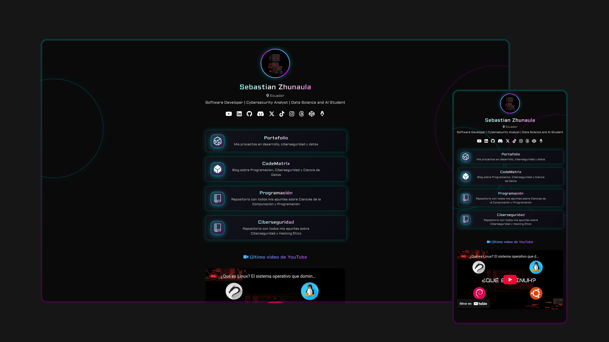

# 🔗 DevLinks44 – Personal Links Page

<p align="center">
  
</p>

**DevLinks44** is a *Linktree*-style web page developed with **Astro**, designed to centralize all your professional links in one place.  
Ideal for sharing your portfolio, social networks, technical blog, and featured projects.

---

## 🌐 Website

👉 [https://devlinks44.netlify.app](https://devlinks44.netlify.app)

---

## 🏗️ Arquitectura DevSecOps (GitLab ➔ GitHub)

Este proyecto implementa una arquitectura profesional con separación estricta entre un **Laboratorio Privado (GitLab)** y un **Portafolio Público (GitHub)**.

### Flujo de Publicación
1. **Desarrollo en GitLab (`main`)**: Toda la programación, pruebas (en `tests/`) y automatización CI/CD (`.gitlab-ci.yml`) ocurre en el repositorio privado.
2. **Ejecución de Script DevSecOps**: Una vez validado el código en GitLab, se ejecuta `scripts/publish_public.ps1`.
3. **Generación Sanitizada**: El script crea una rama temporal `public`.
4. **Eliminación Segura**: Se eliminan del caché todos los componentes privados, pruebas orientadas, y metodologías operativas (como pipelines).
5. **Push a GitHub (`origin`)**: La versión puramente visual y sanitizada se envía al portafolio público de GitHub de forma forzada.
6. **Retorno a GitLab**: El entorno de trabajo local vuelve al "Source of Truth" en GitLab.

### Estructura del Repositorio

- `src/` - Código fuente de componentes de Astro y estilos.
- `public/` - Activos estáticos públicos.
- `scripts/` - Herramientas de ciclo de vida (ej. `publish_public.ps1`). *(Solo GitLab)*
- `tests/` - Pruebas y validaciones locales del proyecto. *(Solo GitLab)*
- `.gitlab-ci.yml` - Integración continua privada. *(Solo GitLab)*

---

## 🚀 Local Installation

```bash
git clone https://gitlab.com/group-programming-lab/DevLinks.git
cd DevLinks
npm install
npm run dev
```

Then open `http://localhost:4321` in your browser.

*(Nota: Usa el repositorio de GitLab si requieres el entorno operativo completo)*

---

## 📜 License

This project is licensed under **MIT**.  
You are free to use it for educational and personal purposes.